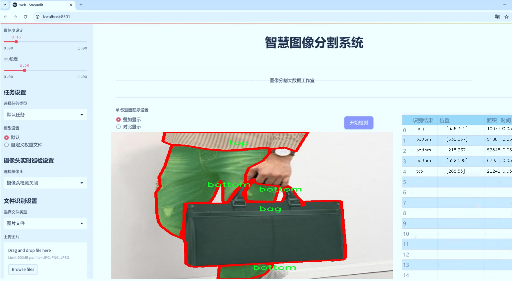
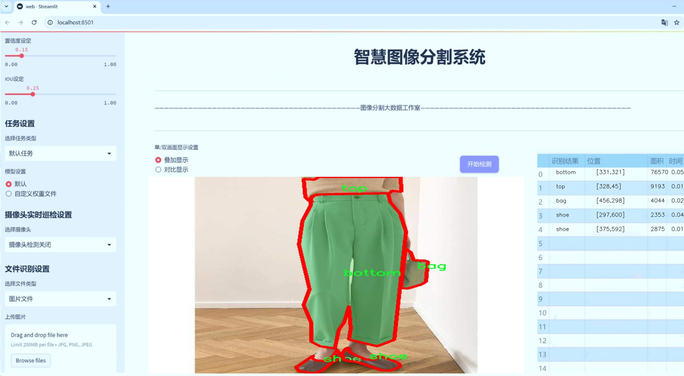
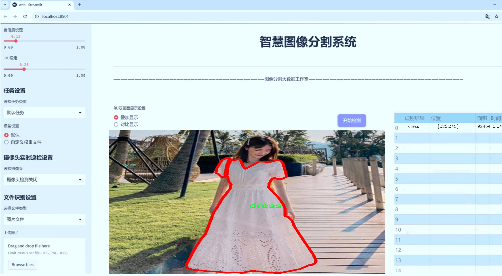
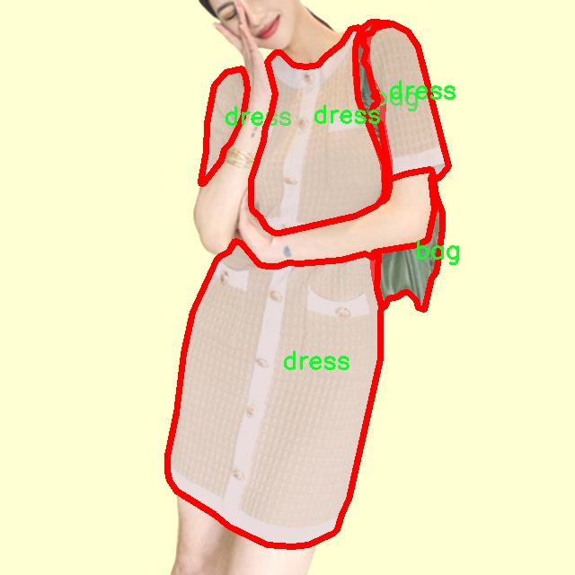
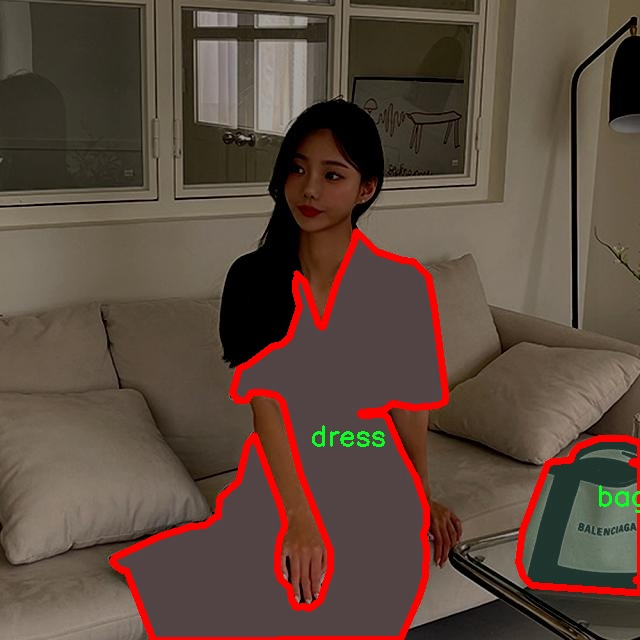
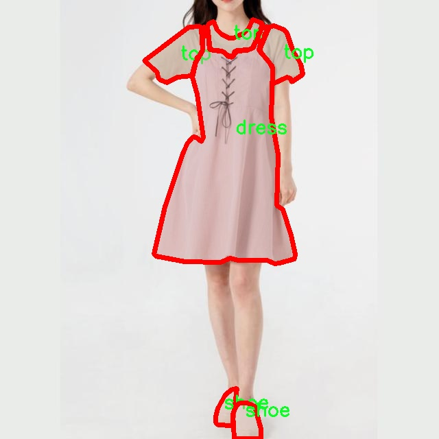
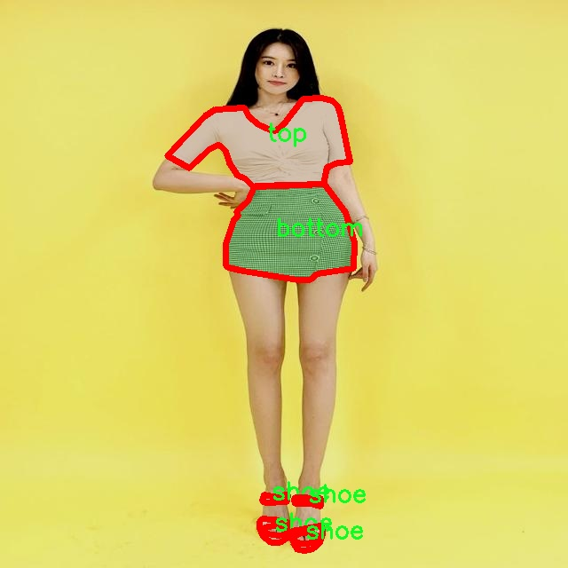
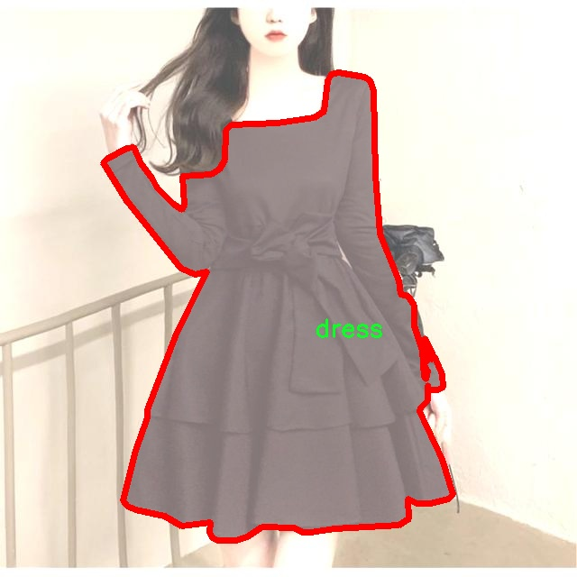
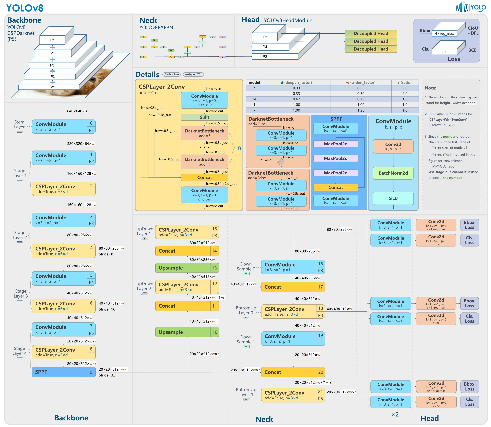
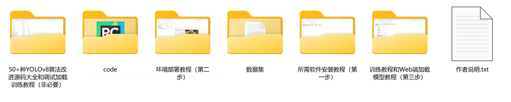

# 衣物识别图像分割系统源码＆数据集分享
 [yolov8-seg-timm＆yolov8-seg-C2f-CloAtt等50+全套改进创新点发刊_一键训练教程_Web前端展示]

### 1.研究背景与意义

项目参考[ILSVRC ImageNet Large Scale Visual Recognition Challenge](https://gitee.com/YOLOv8_YOLOv11_Segmentation_Studio/projects)

项目来源[AAAI Global Al lnnovation Contest](https://kdocs.cn/l/cszuIiCKVNis)

研究背景与意义

随着人工智能技术的迅猛发展，计算机视觉领域的研究逐渐成为学术界和工业界的热点之一。尤其是在图像识别和分割技术方面，深度学习的应用使得图像处理的准确性和效率得到了显著提升。YOLO（You Only Look Once）系列模型作为一种高效的目标检测算法，因其实时性和高精度而受到广泛关注。YOLOv8作为该系列的最新版本，进一步优化了检测精度和速度，适用于多种复杂场景下的目标识别任务。然而，现有的YOLOv8模型在特定领域，如衣物识别与分割方面，仍存在一定的局限性，特别是在多类别物体的细粒度识别和分割任务中。

本研究旨在基于改进的YOLOv8模型，构建一个高效的衣物识别图像分割系统。该系统将针对特定的衣物类别进行训练和优化，以提高在复杂背景下的识别精度和分割效果。为此，我们使用了一个包含1200张图像和35个类别的衣物数据集。该数据集涵盖了多种衣物类型，包括裙子、上衣、裤子、外套等，以及配饰如手袋、腰带和首饰等。这种多样化的类别设置为模型的训练提供了丰富的样本，有助于提升模型的泛化能力和识别精度。

衣物识别技术在多个领域具有重要的应用价值。例如，在时尚电商平台中，能够快速准确地识别用户上传的衣物图像，进而推荐相似款式或搭配方案，将极大提升用户体验和购买转化率。此外，在智能家居、虚拟试衣、社交媒体等场景中，衣物识别技术也能够为用户提供个性化的服务和推荐。因此，构建一个高效的衣物识别图像分割系统，不仅能够推动相关技术的发展，还能为实际应用提供强有力的支持。

通过对YOLOv8模型的改进，我们将探索如何在保持高效性的同时，提升模型在细粒度衣物识别和分割任务中的表现。这一研究不仅有助于推动计算机视觉技术在时尚领域的应用，还将为其他领域的图像识别任务提供借鉴。我们期望通过本研究的深入，能够为衣物识别技术的发展提供新的思路和方法，推动相关产业的创新与进步。

综上所述，基于改进YOLOv8的衣物识别图像分割系统的研究，不仅具有重要的学术价值，也具有广泛的应用前景。通过对衣物类别的细致划分和图像分割技术的优化，我们将为未来的智能时尚服务提供坚实的技术基础，推动相关领域的持续发展。

### 2.图片演示







##### 注意：由于此博客编辑较早，上面“2.图片演示”和“3.视频演示”展示的系统图片或者视频可能为老版本，新版本在老版本的基础上升级如下：（实际效果以升级的新版本为准）

  （1）适配了YOLOV8的“目标检测”模型和“实例分割”模型，通过加载相应的权重（.pt）文件即可自适应加载模型。

  （2）支持“图片识别”、“视频识别”、“摄像头实时识别”三种识别模式。

  （3）支持“图片识别”、“视频识别”、“摄像头实时识别”三种识别结果保存导出，解决手动导出（容易卡顿出现爆内存）存在的问题，识别完自动保存结果并导出到tempDir中。

  （4）支持Web前端系统中的标题、背景图等自定义修改，后面提供修改教程。

  另外本项目提供训练的数据集和训练教程,暂不提供权重文件（best.pt）,需要您按照教程进行训练后实现图片演示和Web前端界面演示的效果。

### 3.视频演示

[3.1 视频演示](https://www.bilibili.com/video/BV1gg2bYXEwW/)

### 4.数据集信息展示

##### 4.1 本项目数据集详细数据（类别数＆类别名）

nc: 6
names: ['bag', 'bottom', 'dress', 'hat', 'shoe', 'top']


##### 4.2 本项目数据集信息介绍

数据集信息展示

在现代计算机视觉领域，图像分割技术的应用日益广泛，尤其是在衣物识别的任务中。为了有效地训练和改进YOLOv8-seg模型，我们采用了名为“closet”的数据集，该数据集专门针对衣物类别的图像分割任务进行了精心设计。该数据集包含六个主要类别，分别是：包（bag）、下装（bottom）、连衣裙（dress）、帽子（hat）、鞋子（shoe）和上装（top）。这些类别涵盖了日常穿着的多样性，为模型提供了丰富的训练样本。

“closet”数据集的构建考虑到了衣物的多样性和复杂性，确保了每个类别在不同环境和背景下的表现。数据集中包含的图像来源于多个场景，包括室内和室外拍摄，展示了不同光照条件、角度和背景的变化。这种多样性不仅增强了模型的鲁棒性，还提高了其在实际应用中的适应能力。例如，包的图像可能是在购物场景中拍摄的，而帽子的图像则可能是在户外活动中捕捉的，这样的设计使得模型能够学习到不同类别在各种环境下的特征。

每个类别的图像都经过精细的标注，确保了图像分割的准确性和一致性。标注过程中，专业的标注团队对每个图像进行了仔细的分析，确保每个衣物类别的边界清晰可辨。这种高质量的标注为模型的训练提供了坚实的基础，使得YOLOv8-seg能够在图像分割任务中实现更高的精度和效率。

此外，数据集还考虑到了类别之间的相似性和差异性。例如，上装和下装在某些情况下可能会有重叠的特征，但通过细致的标注和丰富的样本，模型能够学习到这些微妙的差异，从而在实际应用中做出更为准确的判断。数据集中的每个类别都包含了大量的图像样本，使得模型在训练过程中能够充分学习到每个类别的特征和变化。

为了进一步增强模型的泛化能力，数据集还包含了一些挑战性的样本，例如不同风格的衣物、不同的颜色组合以及复杂的背景。这些样本的引入不仅丰富了数据集的内容，也为模型提供了更具挑战性的训练任务，使得最终的模型在处理实际应用时能够表现得更加出色。

总之，“closet”数据集以其丰富的类别、多样的场景和高质量的标注，为改进YOLOv8-seg的衣物识别图像分割系统提供了坚实的基础。通过对这一数据集的深入研究和应用，我们期望能够推动衣物识别技术的发展，为时尚行业、电子商务以及智能穿戴设备等领域带来更为精准和高效的解决方案。











### 5.全套项目环境部署视频教程（零基础手把手教学）

[5.1 环境部署教程链接（零基础手把手教学）](https://www.bilibili.com/video/BV1jG4Ve4E9t/?vd_source=bc9aec86d164b67a7004b996143742dc)


[5.2 安装Python虚拟环境创建和依赖库安装视频教程链接（零基础手把手教学）](https://www.bilibili.com/video/BV1nA4VeYEze/?vd_source=bc9aec86d164b67a7004b996143742dc)

### 6.手把手YOLOV8-seg训练视频教程（零基础小白有手就能学会）

[6.1 手把手YOLOV8-seg训练视频教程（零基础小白有手就能学会）](https://www.bilibili.com/video/BV1cA4VeYETe/?vd_source=bc9aec86d164b67a7004b996143742dc)


按照上面的训练视频教程链接加载项目提供的数据集，运行train.py即可开始训练



     Epoch   gpu_mem       box       obj       cls    labels  img_size
     1/200     0G   0.01576   0.01955  0.007536        22      1280: 100%|██████████| 849/849 [14:42<00:00,  1.04s/it]
               Class     Images     Labels          P          R     mAP@.5 mAP@.5:.95: 100%|██████████| 213/213 [01:14<00:00,  2.87it/s]
                 all       3395      17314      0.994      0.957      0.0957      0.0843

     Epoch   gpu_mem       box       obj       cls    labels  img_size
     2/200     0G   0.01578   0.01923  0.007006        22      1280: 100%|██████████| 849/849 [14:44<00:00,  1.04s/it]
               Class     Images     Labels          P          R     mAP@.5 mAP@.5:.95: 100%|██████████| 213/213 [01:12<00:00,  2.95it/s]
                 all       3395      17314      0.996      0.956      0.0957      0.0845

     Epoch   gpu_mem       box       obj       cls    labels  img_size
     3/200     0G   0.01561    0.0191  0.006895        27      1280: 100%|██████████| 849/849 [10:56<00:00,  1.29it/s]
               Class     Images     Labels          P          R     mAP@.5 mAP@.5:.95: 100%|███████   | 187/213 [00:52<00:00,  4.04it/s]
                 all       3395      17314      0.996      0.957      0.0957      0.0845


### 7.50+种全套YOLOV8-seg创新点代码加载调参视频教程（一键加载写好的改进模型的配置文件）

[7.1 50+种全套YOLOV8-seg创新点代码加载调参视频教程（一键加载写好的改进模型的配置文件）](https://www.bilibili.com/video/BV1Hw4VePEXv/?vd_source=bc9aec86d164b67a7004b996143742dc)

### 8.YOLOV8-seg图像分割算法原理

原始YOLOV8-seg算法原理

YOLOv8-seg算法是YOLO系列中最新的版本，代表了目标检测领域的一次重要进步。相较于以往的YOLO版本，YOLOv8-seg在算法架构、特征提取和目标定位等方面进行了多项创新，尤其是在处理复杂背景和小目标检测方面表现出色。YOLOv8-seg采用了anchor-free的检测方法，这一策略使得算法在检测精度和速度上均有显著提升。与传统的anchor-based方法相比，anchor-free方法能够更灵活地适应不同形状和大小的目标，从而提高了检测的准确性。

YOLOv8-seg的网络结构主要由输入端、主干网络、Neck端和输出端四个模块组成。输入端负责对输入图像进行预处理，包括Mosaic数据增强、自适应图片缩放和灰度填充等。这些预处理步骤旨在提高模型的鲁棒性，使其能够在多样化的环境中表现良好。主干网络则采用了CSPDarknet的设计理念，通过卷积和池化等操作提取图像特征。在这一过程中，YOLOv8-seg引入了C2f模块，取代了YOLOv5中的C3模块。C2f模块的设计灵感来源于YOLOv7的ELAN思想，具有更强的特征提取能力，能够有效缓解深层网络中的梯度消失问题，从而提高模型的学习效率。

在特征融合方面，YOLOv8-seg采用了PAN-FPN结构，旨在实现多尺度特征的有效融合。通过自下而上的特征融合，YOLOv8-seg能够充分利用不同层次的特征信息，增强对目标的感知能力。这一结构不仅提高了模型对小目标的检测能力，还有效降低了因特征不连续性带来的混淆现象。Neck端的设计使得YOLOv8-seg能够在处理复杂场景时，保持较高的检测精度。

YOLOv8-seg的输出端采用了解耦头结构，这一设计使得分类和回归过程得以分离，从而加速了模型的收敛速度。输出端生成的特征图经过处理后，能够有效地进行目标的分类和定位。此外，YOLOv8-seg还引入了Task-Aligned Assigner方法，对正负样本进行加权匹配，进一步提高了模型的检测性能。

尽管YOLOv8-seg在多个方面进行了优化，但在复杂水面环境下，仍然面临小目标漂浮物特征复杂、背景多样等挑战。为了应对这些问题，YOLOv8-seg在算法的改进上提出了YOLOv8-WSSOD算法。该算法通过引入BiFormer双层路由注意力机制构建C2fBF模块，旨在减轻主干网络下采样过程中的噪声影响，从而保留更多细粒度的上下文信息。此外，为了提升对小目标的感知能力，YOLOv8-WSSOD在网络中添加了一个更小的检测头，并在Neck端引入GSConv和Slim-neck技术，以保持精度的同时降低计算量。

在损失函数的选择上，YOLOv8-seg采用了MPDIoU损失函数替代CIoU损失函数，以提高模型的泛化能力和精准度。这一变化使得YOLOv8-seg在训练过程中能够更好地适应不同类型的目标，提高了检测的准确性。

综上所述，YOLOv8-seg算法通过多项创新和改进，展现了在目标检测领域的强大能力。其anchor-free的设计理念、先进的特征提取和融合策略，以及高效的损失函数选择，使得YOLOv8-seg在复杂环境下的目标检测表现出色。尽管仍面临一些挑战，但通过进一步的优化和改进，YOLOv8-seg有望在未来的应用中取得更大的成功。



### 9.系统功能展示（检测对象为举例，实际内容以本项目数据集为准）

图9.1.系统支持检测结果表格显示

  图9.2.系统支持置信度和IOU阈值手动调节

  图9.3.系统支持自定义加载权重文件best.pt(需要你通过步骤5中训练获得)

  图9.4.系统支持摄像头实时识别

  图9.5.系统支持图片识别

  图9.6.系统支持视频识别

  图9.7.系统支持识别结果文件自动保存

  图9.8.系统支持Excel导出检测结果数据


### 10.50+种全套YOLOV8-seg创新点原理讲解（非科班也可以轻松写刊发刊，V11版本正在科研待更新）

#### 10.1 由于篇幅限制，每个创新点的具体原理讲解就不一一展开，具体见下列网址中的创新点对应子项目的技术原理博客网址【Blog】：


[10.1 50+种全套YOLOV8-seg创新点原理讲解链接](https://gitee.com/qunmasj/good)

#### 10.2 部分改进模块原理讲解(完整的改进原理见上图和技术博客链接)【如果此小节的图加载失败可以通过CSDN或者Github搜索该博客的标题访问原始博客，原始博客图片显示正常】

### YOLOv8简介
YOLOv8是一种目标检测模型，是基于YOLO (You Only Look Once)系列算法发展而来的最新版本。它的核心思想是将目标检测任务转化为一个回归问题，通过单次前向传播即可直接预测出图像中的多个目标的位置和类别。
YOLOv8的网络结构采用了Darknet作为其主干网络，主要由卷积层和池化层构成。与之前的版本相比，YOLOv8在网络结构上进行了改进，引入了更多的卷积层和残差模块，以提高模型的准确性和鲁棒性。
YOLOv8采用了一种特征金字塔网络(Feature Pyramid Network,FPN)的结构，通过在不同层级上融合多尺度的特征信息，可以对不同尺度的目标进行有效的检测。此外，YOLOv8还引入了一种自适应感知域(Adaptive Anchors
的机制，通过自适应地学习目标的尺度和
长宽比，提高了模型对于不同尺度和形状目标的检测效果。
总体来说，YOLOv8结构模型综合了多个先进的目标检测技术，在保证检测速度的同时提升了检测精度和鲁棒性，被广泛应用于实时目标检测任务中。


#### yolov8网络模型结构图

YOLOv8 (You Only Look Once version 8)是一种目标检测算法，它在实时场景下可以快速准确地检测图像中的目标。
YOLOv8的网络模型结构基于Darknet框架，由一系列卷积层、池化层和全连接层组成。主要包含以下几个组件:
1.输入层:接收输入图像。
2.卷积层:使用不同尺寸的卷积核来提取图像特征。
3.残差块(Residual blocks):通过使用跳跃连接(skip connections）来解决梯度消失问题，使得网络更容易训练。
4.上采样层(Upsample layers):通过插值操作将特征图的尺寸放大，以便在不同尺度上进行目标检测。
5.池化层:用于减小特征图的尺寸，同时保留重要的特征。
6.1x1卷积层:用于降低通道数，减少网络参数量。
7.3x3卷积层:用于进—步提取和组合特征。
8.全连接层:用于最后的目标分类和定位。
YOLOv8的网络结构采用了多个不同尺度的特征图来检测不同大小的目标，从而提高了目标检测的准确性和多尺度性能。
请注意，YOLOv8网络模型结构图的具体细节可能因YOLO版本和实现方式而有所不同。


#### yolov8模型结构
YOLOv8模型是一种目标检测模型，其结构是基于YOLOv3模型进行改进的。模型结构可以分为主干网络和检测头两个部分。
主干网络是一种由Darknet-53构成的卷积神经网络。Darknet-53是一个经过多层卷积和残差连接构建起来的深度神经网络。它能够提取图像的特征信息，并将这些信息传递给检测头。
检测头是YOLOv8的关键部分，它负责在图像中定位和识别目标。检测头由一系列卷积层和全连接层组成。在每个检测头中，会生成一组锚框，并针对每个锚框预测目标的类别和位置信息。
YOLOv8模型使用了预训练的权重，其中在COCO数据集上进行了训练。这意味着该模型已经通过大规模数据集的学习，具有一定的目标检测能力。

### RT-DETR骨干网络HGNetv2简介
#### RT-DETR横空出世
前几天被百度的RT-DETR刷屏，参考该博客提出的目标检测新范式对原始DETR的网络结构进行了调整和优化，以提高计算速度和减小模型大小。这包括使用更轻量级的基础网络和调整Transformer结构。并且，摒弃了nms处理的detr结构与传统的物体检测方法相比，不仅训练是端到端的，检测也能端到端，这意味着整个网络在训练过程中一起进行优化，推理过程不需要昂贵的后处理代价，这有助于提高模型的泛化能力和性能。


当然，人们对RT-DETR之所以产生浓厚的兴趣，我觉得大概率还是对YOLO系列审美疲劳了，就算是出到了YOLO10086，我还是只想用YOLOv5和YOLOv7的框架来魔改做业务。。

#### 初识HGNet
看到RT-DETR的性能指标，发现指标最好的两个模型backbone都是用的HGNetv2，毫无疑问，和当时的picodet一样，骨干都是使用百度自家的网络。初识HGNet的时候，当时是参加了第四届百度网盘图像处理大赛，文档图像方向识别专题赛道，简单来说，就是使用分类网络对一些文档截图或者图片进行方向角度分类。


当时的方案并没有那么快定型，通常是打榜过程发现哪个网络性能好就使用哪个网络做魔改，而且木有显卡，只能蹭Ai Studio的平台，不过v100一天8小时的实验时间有点短，这也注定了大模型用不了。 

流水的模型，铁打的炼丹人，最后发现HGNet-tiny各方面指标都很符合我们的预期，后面就一直围绕它魔改。当然，比赛打榜是目的，学习才是享受过程，当时看到效果还可以，便开始折腾起了HGNet的网络架构，我们可以看到，PP-HGNet 针对 GPU 设备，对目前 GPU 友好的网络做了分析和归纳，尽可能多的使用 3x3 标准卷积（计算密度最高），PP-HGNet是由多个HG-Block组成，细节如下：


ConvBNAct是啥？简单聊一聊，就是Conv+BN+Act，CV Man应该最熟悉不过了：
```python
class ConvBNAct(TheseusLayer):
    def __init__(self,
                 in_channels,
                 out_channels,
                 kernel_size,
                 stride,
                 groups=1,
                 use_act=True):
        super().__init__()
        self.use_act = use_act
        self.conv = Conv2D(
            in_channels,
            out_channels,
            kernel_size,
            stride,
            padding=(kernel_size - 1) // 2,
            groups=groups,
            bias_attr=False)
        self.bn = BatchNorm2D(
            out_channels,
            weight_attr=ParamAttr(regularizer=L2Decay(0.0)),
            bias_attr=ParamAttr(regularizer=L2Decay(0.0)))
        if self.use_act:
            self.act = ReLU()
 
    def forward(self, x):
        x = self.conv(x)
        x = self.bn(x)
        if self.use_act:
            x = self.act(x)
        return x 
```
且标准卷积的数量随层数深度增加而增多，从而得到一个有利于 GPU 推理的骨干网络，同样速度下，精度也超越其他 CNN ，性价比也优于ViT-base模型。


另外，我们可以看到：

PP-HGNet 的第一层由channel为96的Stem模块构成，目的是为了减少参数量和计算量。PP-HGNet

Tiny的整体结构由四个HG Stage构成，而每个HG Stage主要由包含大量标准卷积的HG Block构成。

PP-HGNet的第三到第五层使用了使用了可学习的下采样层（LDS Layer），该层group为输入通道数，可达到降参降计算量的作用，且Tiny模型仅包含三个LDS Layer，并不会对GPU的利用率造成较大影响.

PP-HGNet的激活函数为Relu，常数级操作可保证该模型在硬件上的推理速度。

### 11.项目核心源码讲解（再也不用担心看不懂代码逻辑）

#### 11.1 ultralytics\data\augment.py

以下是经过精简和注释的核心代码部分，主要保留了与图像增强和变换相关的类和方法。

```python
import random
import numpy as np
import cv2

class BaseTransform:
    """
    基础图像变换类，定义了图像增强的基本结构。
    """

    def __init__(self) -> None:
        """初始化变换对象。"""
        pass

    def apply_image(self, labels):
        """应用图像变换到标签。"""
        pass

    def apply_instances(self, labels):
        """应用变换到对象实例标签。"""
        pass

    def apply_semantic(self, labels):
        """应用语义分割变换到图像。"""
        pass

    def __call__(self, labels):
        """调用所有标签变换。"""
        self.apply_image(labels)
        self.apply_instances(labels)
        self.apply_semantic(labels)


class Compose:
    """
    组合多个图像变换的类。
    """

    def __init__(self, transforms):
        """初始化组合对象，接受变换列表。"""
        self.transforms = transforms

    def __call__(self, data):
        """依次应用变换到输入数据。"""
        for t in self.transforms:
            data = t(data)
        return data


class RandomFlip:
    """
    随机翻转图像（水平或垂直）。
    """

    def __init__(self, p=0.5, direction='horizontal') -> None:
        """初始化翻转类，设置翻转概率和方向。"""
        assert direction in ['horizontal', 'vertical'], "方向必须为'horizontal'或'vertical'"
        self.p = p
        self.direction = direction

    def __call__(self, labels):
        """应用随机翻转到图像和实例。"""
        img = labels['img']
        if random.random() < self.p:
            if self.direction == 'horizontal':
                img = np.fliplr(img)  # 水平翻转
            elif self.direction == 'vertical':
                img = np.flipud(img)  # 垂直翻转
        labels['img'] = img
        return labels


class RandomHSV:
    """
    随机调整图像的HSV（色相、饱和度、明度）通道。
    """

    def __init__(self, hgain=0.5, sgain=0.5, vgain=0.5) -> None:
        """初始化HSV调整类，设置每个通道的增益。"""
        self.hgain = hgain
        self.sgain = sgain
        self.vgain = vgain

    def __call__(self, labels):
        """应用随机HSV增强到图像。"""
        img = labels['img']
        if self.hgain or self.sgain or self.vgain:
            r = np.random.uniform(-1, 1, 3) * [self.hgain, self.sgain, self.vgain] + 1  # 随机增益
            img_hsv = cv2.cvtColor(img, cv2.COLOR_BGR2HSV)
            img_hsv[..., 0] = (img_hsv[..., 0] * r[0]) % 180  # 色相调整
            img_hsv[..., 1] = np.clip(img_hsv[..., 1] * r[1], 0, 255)  # 饱和度调整
            img_hsv[..., 2] = np.clip(img_hsv[..., 2] * r[2], 0, 255)  # 明度调整
            img = cv2.cvtColor(img_hsv, cv2.COLOR_HSV2BGR)  # 转回BGR
        labels['img'] = img
        return labels


class LetterBox:
    """
    调整图像大小并添加边框以适应检测任务。
    """

    def __init__(self, new_shape=(640, 640), auto=False):
        """初始化LetterBox对象，设置目标形状和自动调整标志。"""
        self.new_shape = new_shape
        self.auto = auto

    def __call__(self, labels):
        """调整图像大小并添加边框。"""
        img = labels['img']
        shape = img.shape[:2]  # 当前形状 [高度, 宽度]
        r = min(self.new_shape[0] / shape[0], self.new_shape[1] / shape[1])  # 缩放比例
        new_unpad = int(round(shape[1] * r)), int(round(shape[0] * r))  # 新尺寸
        dw, dh = self.new_shape[1] - new_unpad[0], self.new_shape[0] - new_unpad[1]  # 计算填充
        dw, dh = dw / 2, dh / 2  # 平均分配填充
        img = cv2.resize(img, new_unpad, interpolation=cv2.INTER_LINEAR)  # 调整图像大小
        img = cv2.copyMakeBorder(img, int(dh), int(dh), int(dw), int(dw), cv2.BORDER_CONSTANT, value=(114, 114, 114))  # 添加边框
        labels['img'] = img
        return labels


def v8_transforms(dataset, imgsz, hyp):
    """定义YOLOv8训练所需的图像变换。"""
    return Compose([
        RandomFlip(direction='horizontal', p=hyp.flipud),  # 随机水平翻转
        RandomHSV(hgain=hyp.hsv_h, sgain=hyp.hsv_s, vgain=hyp.hsv_v),  # 随机HSV调整
        LetterBox(new_shape=(imgsz, imgsz)),  # 调整图像大小
    ])
```

### 代码说明：
1. **BaseTransform**: 基础变换类，定义了图像变换的基本结构。
2. **Compose**: 组合多个变换的类，可以将多个变换按顺序应用到图像上。
3. **RandomFlip**: 随机翻转图像的类，支持水平和垂直翻转。
4. **RandomHSV**: 随机调整图像的HSV通道的类，允许对色相、饱和度和明度进行调整。
5. **LetterBox**: 调整图像大小并添加边框的类，确保图像适应特定的输入尺寸。
6. **v8_transforms**: 定义YOLOv8训练所需的图像变换组合。

这些类和方法是图像增强的核心部分，可以在训练深度学习模型时使用，以提高模型的泛化能力。

这个文件 `ultralytics\data\augment.py` 是一个用于图像增强的模块，主要用于在训练计算机视觉模型时对图像进行各种变换和增强操作。该模块包含多个类和方法，旨在为图像分类、目标检测和语义分割等任务提供灵活的增强策略。

首先，文件中定义了一个基类 `BaseTransform`，用于图像变换的基础结构。这个类提供了多个方法，包括初始化、应用图像变换、应用实例变换和应用语义分割变换。用户可以通过继承这个类来实现特定的图像处理需求。

接下来是 `Compose` 类，它用于将多个图像变换组合在一起。这个类允许用户按顺序应用一系列变换，并提供了添加新变换和将变换列表转换为标准 Python 列表的方法。

`BaseMixTransform` 类是一个基类，用于实现混合增强（如 MixUp 和 Mosaic）。它的构造函数接受数据集、预处理变换和应用概率，并定义了一个调用方法来应用这些变换。具体的增强方法将在子类中实现。

`Mosaic` 类是 `BaseMixTransform` 的一个实现，它通过将多个图像组合成一个马赛克图像来进行增强。该类支持 4 或 9 张图像的组合，并在构造函数中定义了图像大小、应用概率和网格大小。`get_indexes` 方法用于随机选择图像索引，而 `_mix_transform` 方法则根据选择的图像进行马赛克处理。

`MixUp` 类也是 `BaseMixTransform` 的一个实现，主要用于将两张图像进行混合。它通过计算一个随机比例来融合两张图像，并将其标签合并。

`RandomPerspective` 类实现了随机透视和仿射变换，能够对图像及其对应的边界框、分割和关键点进行旋转、平移、缩放和剪切等操作。该类的构造函数接受多个参数以控制变换的程度，并提供了多个方法来应用这些变换。

`RandomHSV` 类负责对图像的色调、饱和度和亮度进行随机调整，以增强图像的多样性。`RandomFlip` 类则用于随机水平或垂直翻转图像，并相应地更新实例（如边界框和关键点）。

`LetterBox` 类用于调整图像大小并进行填充，以适应目标检测和实例分割任务。它的构造函数接受新的形状、自动调整标志和步幅参数。`CopyPaste` 类实现了复制粘贴增强，通过将实例从一张图像复制到另一张图像来增加数据多样性。

`Albumentations` 类是一个可选的增强模块，使用 `albumentations` 库提供了一系列图像变换。它可以执行模糊、对比度调整、随机亮度和压缩等操作。

最后，`Format` 类用于格式化图像注释，以便在 PyTorch 的 DataLoader 中使用。它标准化图像和实例注释，并提供了处理掩码和关键点的选项。

整个模块通过定义一系列灵活的增强策略，旨在提高模型的泛化能力和鲁棒性，适用于各种计算机视觉任务。

#### 11.2 ultralytics\nn\extra_modules\kernel_warehouse.py

以下是经过简化和注释的核心代码部分，主要保留了 `Attention` 和 `KWConvNd` 类，以及 `Warehouse_Manager` 类的基本结构和功能。

```python
import torch
import torch.nn as nn
import torch.nn.functional as F

class Attention(nn.Module):
    def __init__(self, in_planes, reduction, num_static_cell, num_local_mixture, norm_layer=nn.BatchNorm1d):
        """
        初始化 Attention 模块
        :param in_planes: 输入通道数
        :param reduction: 隐藏层通道数的缩减比例
        :param num_static_cell: 静态单元的数量
        :param num_local_mixture: 本地混合的数量
        :param norm_layer: 归一化层
        """
        super(Attention, self).__init__()
        hidden_planes = max(int(in_planes * reduction), 16)  # 计算隐藏层通道数
        self.kw_planes_per_mixture = num_static_cell + 1  # 每个混合的通道数
        self.num_local_mixture = num_local_mixture  # 本地混合数量
        self.kw_planes = self.kw_planes_per_mixture * num_local_mixture  # 总通道数

        # 定义层
        self.avgpool = nn.AdaptiveAvgPool1d(1)  # 自适应平均池化
        self.fc1 = nn.Linear(in_planes, hidden_planes)  # 全连接层
        self.norm1 = norm_layer(hidden_planes)  # 归一化层
        self.act1 = nn.ReLU(inplace=True)  # 激活函数

        # 初始化权重
        self._initialize_weights()

    def _initialize_weights(self):
        """初始化网络权重"""
        for m in self.modules():
            if isinstance(m, nn.Linear):
                nn.init.kaiming_normal_(m.weight, mode='fan_out', nonlinearity='relu')  # Kaiming 初始化
                if m.bias is not None:
                    nn.init.constant_(m.bias, 0)  # 偏置初始化为0
            if isinstance(m, nn.BatchNorm1d):
                nn.init.constant_(m.weight, 1)  # 归一化层权重初始化为1
                nn.init.constant_(m.bias, 0)  # 偏置初始化为0

    def forward(self, x):
        """前向传播"""
        x = self.avgpool(x.reshape(*x.shape[:2], -1)).squeeze(dim=-1)  # 池化操作
        x = self.act1(self.norm1(self.fc1(x)))  # 通过全连接层、归一化和激活函数
        return x  # 返回结果

class KWconvNd(nn.Module):
    def __init__(self, in_planes, out_planes, kernel_size, stride=1, padding=0, dilation=1, groups=1, bias=False):
        """
        初始化 KWconvNd 模块
        :param in_planes: 输入通道数
        :param out_planes: 输出通道数
        :param kernel_size: 卷积核大小
        :param stride: 步幅
        :param padding: 填充
        :param dilation: 膨胀
        :param groups: 分组卷积
        :param bias: 是否使用偏置
        """
        super(KWconvNd, self).__init__()
        self.in_planes = in_planes
        self.out_planes = out_planes
        self.kernel_size = kernel_size  # 卷积核大小
        self.stride = stride  # 步幅
        self.padding = padding  # 填充
        self.dilation = dilation  # 膨胀
        self.groups = groups  # 分组卷积
        self.bias = nn.Parameter(torch.zeros([self.out_planes]), requires_grad=True) if bias else None  # 偏置参数

    def forward(self, x):
        """前向传播"""
        # 这里可以实现卷积操作，省略具体实现
        return x  # 返回结果

class Warehouse_Manager(nn.Module):
    def __init__(self, reduction=0.0625):
        """
        初始化 Warehouse_Manager
        :param reduction: 隐藏层通道数的缩减比例
        """
        super(Warehouse_Manager, self).__init__()
        self.reduction = reduction  # 缩减比例
        self.warehouse_list = {}  # 存储仓库信息

    def reserve(self, in_planes, out_planes, kernel_size=1, stride=1, padding=0, dilation=1, groups=1, bias=True):
        """
        创建动态卷积层的占位符
        :param in_planes: 输入通道数
        :param out_planes: 输出通道数
        :param kernel_size: 卷积核大小
        :param stride: 步幅
        :param padding: 填充
        :param dilation: 膨胀
        :param groups: 分组卷积
        :param bias: 是否使用偏置
        """
        # 这里可以实现仓库的逻辑，省略具体实现
        return None  # 返回占位符

    def store(self):
        """存储仓库信息"""
        # 这里可以实现存储逻辑，省略具体实现
        pass  # 省略实现

    def take_cell(self, warehouse_idx):
        """获取仓库中的单元"""
        return None  # 返回指定仓库的单元
```

### 代码说明：
1. **Attention 类**：实现了一个注意力机制，包含了输入通道数、缩减比例、静态单元数量和本地混合数量等参数。通过全连接层、归一化和激活函数进行前向传播。

2. **KWconvNd 类**：定义了一个通用的卷积层，支持多维卷积操作，初始化了输入输出通道、卷积核大小、步幅、填充等参数。

3. **Warehouse_Manager 类**：管理卷积层的权重仓库，提供了创建动态卷积层的占位符和存储仓库信息的功能。

以上代码展示了核心的卷积操作和注意力机制的实现，适用于深度学习模型的构建。

这个程序文件 `kernel_warehouse.py` 是一个用于深度学习模型的模块，主要实现了一个内核仓库管理器和一些相关的卷积层。文件中包含了多个类和函数，主要功能是通过动态管理卷积核来优化模型的参数和计算效率。

首先，文件导入了一些必要的库，包括 PyTorch 的核心模块和一些数学工具。`__all__` 变量定义了该模块的公共接口，表明哪些类可以被外部访问。

`parse` 函数用于处理输入参数，确保输入的格式符合预期。它可以将单个值或可迭代对象转换为指定长度的列表，便于后续处理。

`Attention` 类实现了一个注意力机制模块。它的构造函数接收多个参数，包括输入通道数、缩减比例、静态单元数量、局部混合数量等。该类内部定义了多个线性层和归一化层，并在前向传播中计算注意力权重。注意力机制的核心在于通过动态调整权重来选择不同的卷积核，从而提高模型的表现。

`KWconvNd` 类是一个通用的卷积层类，支持多维卷积（1D、2D、3D）。它的构造函数接收输入和输出通道数、卷积核大小、步幅、填充、扩张、分组等参数，并根据这些参数初始化卷积层。该类还定义了 `init_attention` 方法，用于初始化注意力机制，并在前向传播中计算输出。

接下来，`KWConv1d`、`KWConv2d` 和 `KWConv3d` 类分别继承自 `KWconvNd`，实现了一维、二维和三维卷积的具体操作。每个类都定义了适合其维度的卷积操作和数据排列方式。

`KWLinear` 类实现了一个线性层，实际上是通过一维卷积来实现的。它的前向传播方法将输入数据调整为适合卷积操作的形状，然后再通过卷积层进行处理。

`Warehouse_Manager` 类是核心管理器，负责管理卷积核的动态分配和存储。它允许用户定义多个卷积层的共享参数，并通过 `reserve` 方法记录每个层的卷积核信息。`store` 方法计算每个仓库的卷积核形状，并为每个卷积层分配相应的参数。`allocate` 方法则负责在网络中分配这些参数，并初始化权重。

最后，`KWConv` 类是一个简单的卷积模块，它结合了卷积层、批归一化和激活函数，提供了一个方便的接口来构建卷积神经网络。

此外，文件还定义了一个 `get_temperature` 函数，用于根据当前迭代次数和训练周期动态调整温度值，这在训练过程中可能用于控制模型的探索与利用平衡。

总体而言，这个文件实现了一个灵活的卷积核管理机制，能够根据模型的需求动态调整卷积核的使用，从而提高深度学习模型的性能和效率。

#### 11.3 ultralytics\trackers\__init__.py

以下是经过简化和详细注释的核心代码部分：

```python
# 导入所需的跟踪器类
from .bot_sort import BOTSORT  # 导入BOTSORT类，用于目标跟踪
from .byte_tracker import BYTETracker  # 导入BYTETracker类，用于目标跟踪
from .track import register_tracker  # 导入注册跟踪器的函数

# 定义可供外部使用的模块接口
__all__ = 'register_tracker', 'BOTSORT', 'BYTETracker'  # 允许简化导入，指定外部可访问的类和函数
```

### 代码注释说明：
1. **导入模块**：
   - `from .bot_sort import BOTSORT`：从当前包中导入 `BOTSORT` 类，这个类通常用于实现一种特定的目标跟踪算法。
   - `from .byte_tracker import BYTETracker`：从当前包中导入 `BYTETracker` 类，另一个用于目标跟踪的实现。
   - `from .track import register_tracker`：从当前包中导入 `register_tracker` 函数，该函数用于注册不同的跟踪器，以便在系统中使用。

2. **模块接口定义**：
   - `__all__`：这是一个特殊的变量，用于定义当使用 `from module import *` 时，哪些名称会被导入。这里指定了 `register_tracker`、`BOTSORT` 和 `BYTETracker`，使得用户可以更方便地使用这些功能，而不需要知道内部实现的细节。

这个程序文件是一个Python模块的初始化文件，位于`ultralytics/trackers`目录下。它的主要功能是导入和组织与目标跟踪相关的类和函数，以便在其他地方使用时更加方便。

首先，文件开头的注释表明这是Ultralytics YOLO项目的一部分，并且使用的是AGPL-3.0许可证。这意味着该项目是开源的，用户可以自由使用和修改，但需要遵循相关的许可证条款。

接下来，文件通过相对导入的方式引入了三个组件：`BOTSORT`、`BYTETracker`和`register_tracker`。这些组件分别来自于同一目录下的不同模块文件。`BOTSORT`和`BYTETracker`是两种不同的目标跟踪算法，而`register_tracker`则是一个用于注册跟踪器的函数。

最后，`__all__`变量定义了当使用`from module import *`语句时，哪些名称会被导入。在这里，它包含了`register_tracker`、`BOTSORT`和`BYTETracker`，这使得用户在导入这个模块时可以直接使用这些名称，而不需要知道它们具体的实现细节。

总体来说，这个初始化文件的作用是简化模块的导入过程，使得使用者能够更方便地访问目标跟踪相关的功能。

#### 11.4 train.py

以下是代码中最核心的部分，并附上详细的中文注释：

```python
import os
import torch
import yaml
from ultralytics import YOLO  # 导入YOLO模型库

if __name__ == '__main__':  # 确保该模块被直接运行时才执行以下代码
    # 设置训练参数
    workers = 1  # 数据加载的工作进程数
    batch = 8  # 每个批次的样本数量，需根据显存/内存情况调整
    device = "0" if torch.cuda.is_available() else "cpu"  # 判断是否使用GPU

    # 获取数据集的yaml配置文件的绝对路径
    data_path = abs_path(f'datasets/data/data.yaml', path_type='current')  

    # 获取数据集目录路径
    directory_path = os.path.dirname(data_path.replace(os.sep, '/'))

    # 读取YAML文件，保持原有顺序
    with open(data_path, 'r') as file:
        data = yaml.load(file, Loader=yaml.FullLoader)

    # 修改YAML文件中的训练、验证和测试数据路径
    if 'train' in data and 'val' in data and 'test' in data:
        data['train'] = directory_path + '/train'  # 设置训练数据路径
        data['val'] = directory_path + '/val'      # 设置验证数据路径
        data['test'] = directory_path + '/test'    # 设置测试数据路径

        # 将修改后的数据写回YAML文件
        with open(data_path, 'w') as file:
            yaml.safe_dump(data, file, sort_keys=False)

    # 加载YOLO模型配置文件并加载预训练权重
    model = YOLO(r"C:\codeseg\codenew\50+种YOLOv8算法改进源码大全和调试加载训练教程（非必要）\改进YOLOv8模型配置文件\yolov8-seg-C2f-Faster.yaml").load("./weights/yolov8s-seg.pt")

    # 开始训练模型
    results = model.train(
        data=data_path,  # 指定训练数据的配置文件路径
        device=device,  # 指定使用的设备（GPU或CPU）
        workers=workers,  # 指定数据加载的工作进程数
        imgsz=640,  # 输入图像的大小为640x640
        epochs=100,  # 训练100个epoch
        batch=batch,  # 每个批次的大小为8
    )
```

### 代码注释说明：
1. **导入必要的库**：导入了处理文件路径、深度学习框架、YAML文件读取和YOLO模型的相关库。
2. **主程序入口**：使用`if __name__ == '__main__':`确保代码块只在直接运行该脚本时执行。
3. **设置训练参数**：定义了数据加载的工作进程数、批次大小和设备选择（GPU或CPU）。
4. **读取和修改YAML配置文件**：读取数据集的配置文件，修改其中的训练、验证和测试数据路径，并将修改后的内容写回文件。
5. **加载YOLO模型**：根据指定的配置文件和预训练权重加载YOLO模型。
6. **开始训练模型**：调用模型的`train`方法进行训练，传入数据路径、设备、工作进程数、图像大小、训练轮数和批次大小等参数。

这个程序文件 `train.py` 是一个用于训练 YOLO（You Only Look Once）模型的脚本。首先，程序导入了必要的库，包括 `os`、`torch`、`yaml` 和 `ultralytics` 中的 YOLO 模型。接着，程序设置了 matplotlib 的后端为 TkAgg，以便在图形界面中显示。

在 `if __name__ == '__main__':` 这一部分，程序确保只有在直接运行该脚本时才会执行以下代码。首先定义了一些参数，包括工作进程数 `workers`、批次大小 `batch` 和设备类型 `device`。设备类型会根据是否有可用的 GPU 来选择，如果有则使用 GPU（设备编号为 "0"），否则使用 CPU。

接下来，程序通过 `abs_path` 函数获取数据集配置文件 `data.yaml` 的绝对路径，并将路径中的分隔符统一为 Unix 风格的斜杠。然后，程序提取该路径的目录部分，以便后续使用。

程序打开 `data.yaml` 文件并读取其内容，使用 `yaml.load` 方法保持原有顺序。接着，程序检查 YAML 文件中是否包含 'train'、'val' 和 'test' 三个键，如果存在，则将这些键的值修改为相应的训练、验证和测试数据的路径，并将修改后的内容写回到 YAML 文件中。

程序还提到，不同的模型对设备的要求不同，如果在训练时遇到错误，可以尝试使用其他模型配置文件。随后，程序加载指定的 YOLO 模型配置文件和预训练权重。

最后，程序调用 `model.train` 方法开始训练模型，传入训练数据的配置文件路径、设备、工作进程数、输入图像大小、训练的 epoch 数量和批次大小等参数。这样，整个训练过程就被启动了。

#### 11.5 ultralytics\utils\callbacks\comet.py

以下是经过简化并添加详细中文注释的核心代码部分：

```python
# 导入必要的库
from ultralytics.utils import LOGGER, RANK, SETTINGS, ops
import os
from pathlib import Path

# 检查是否正在运行测试，并确保Comet集成已启用
try:
    assert not TESTS_RUNNING  # 确保不是在运行pytest
    assert SETTINGS['comet'] is True  # 确保Comet集成已启用
    import comet_ml  # 导入Comet库

    assert hasattr(comet_ml, '__version__')  # 确保Comet库已正确安装

except (ImportError, AssertionError):
    comet_ml = None  # 如果导入失败，则将comet_ml设置为None

def _get_comet_mode():
    """获取环境变量中设置的Comet模式，默认为'online'。"""
    return os.getenv('COMET_MODE', 'online')

def _create_experiment(args):
    """创建Comet实验对象，仅在分布式训练的主进程中创建。"""
    if RANK not in (-1, 0):  # 仅在主进程中创建实验
        return
    try:
        comet_mode = _get_comet_mode()  # 获取Comet模式
        project_name = os.getenv('COMET_PROJECT_NAME', args.project)  # 获取项目名称
        experiment = comet_ml.Experiment(project_name=project_name) if comet_mode != 'offline' else comet_ml.OfflineExperiment(project_name=project_name)
        experiment.log_parameters(vars(args))  # 记录参数
    except Exception as e:
        LOGGER.warning(f'WARNING ⚠️ Comet未正确初始化，无法记录此运行。{e}')

def _log_images(experiment, image_paths, curr_step, annotations=None):
    """将图像及其注释记录到Comet实验中。"""
    if annotations:
        for image_path, annotation in zip(image_paths, annotations):
            experiment.log_image(image_path, name=image_path.stem, step=curr_step, annotations=annotation)
    else:
        for image_path in image_paths:
            experiment.log_image(image_path, name=image_path.stem, step=curr_step)

def on_train_epoch_end(trainer):
    """在每个训练周期结束时记录指标和保存批次图像。"""
    experiment = comet_ml.get_global_experiment()  # 获取当前的Comet实验
    if not experiment:
        return

    curr_epoch = trainer.epoch + 1  # 当前周期
    curr_step = curr_epoch * (len(trainer.train_loader.dataset) // trainer.batch_size)  # 当前步骤

    experiment.log_metrics(trainer.label_loss_items(trainer.tloss, prefix='train'), step=curr_step, epoch=curr_epoch)  # 记录训练损失

def on_train_end(trainer):
    """在训练结束时执行操作。"""
    experiment = comet_ml.get_global_experiment()  # 获取当前的Comet实验
    if not experiment:
        return

    experiment.end()  # 结束实验

# 定义回调函数
callbacks = {
    'on_train_epoch_end': on_train_epoch_end,
    'on_train_end': on_train_end
} if comet_ml else {}
```

### 代码注释说明：
1. **导入库**：导入必要的库和模块，确保可以使用Comet进行实验记录。
2. **环境变量检查**：确保Comet库正确安装并且集成已启用。
3. **获取Comet模式**：定义函数以获取当前的Comet模式，默认为“在线”。
4. **创建实验**：定义函数以创建Comet实验对象，确保仅在主进程中创建。
5. **记录图像**：定义函数以将图像及其注释记录到Comet实验中。
6. **训练周期结束**：在每个训练周期结束时记录训练损失等指标。
7. **训练结束**：在训练结束时结束Comet实验。

通过这些核心部分和注释，可以理解代码的主要功能和结构。

这个程序文件是一个用于集成 Comet.ml 的回调模块，主要用于在 Ultralytics YOLO 模型训练过程中记录和可视化实验数据。文件中包含了多个函数和回调，用于处理与 Comet.ml 的交互，记录训练过程中的各种信息。

首先，文件导入了一些必要的模块和设置，包括日志记录器、训练状态、设置选项等。接着，程序通过一些断言来确保在运行时的环境是合适的，比如确保不是在测试状态下，并且 Comet 集成已启用。如果导入 Comet.ml 失败或不符合预期，则将其设置为 None。

接下来的几个函数主要用于从环境变量中获取配置信息，例如 Comet 的模式、模型名称、评估批次日志记录间隔、最大图像预测数量等。这些设置可以帮助用户根据自己的需求调整日志记录的行为。

程序中定义了一些函数来处理训练过程中的数据记录，包括获取当前训练的元数据、缩放边界框以适应原始图像形状、格式化真实标签和预测结果等。这些函数确保在记录时，数据的格式和内容是正确的。

在训练的不同阶段，程序会调用相应的回调函数。例如，在预训练开始时创建或恢复 Comet 实验，在每个训练周期结束时记录当前的指标和图像，在训练结束时记录最终的模型和评估结果。每个回调函数都包含逻辑来处理实验的创建、数据的记录以及可能的异常处理。

最后，文件将所有的回调函数汇总到一个字典中，以便在训练过程中能够方便地调用这些函数。整体来看，这个模块的目的是为了简化与 Comet.ml 的集成，使得用户能够轻松地记录和可视化他们的模型训练过程。

#### 11.6 ultralytics\utils\checks.py

以下是代码中最核心的部分，并附上详细的中文注释：

```python
import os
import platform
import subprocess
import sys
from pathlib import Path
from typing import Optional

import torch
from ultralytics.utils import LOGGER, ROOT, USER_CONFIG_DIR, SimpleNamespace, check_requirements


def check_python(minimum: str = '3.8.0') -> bool:
    """
    检查当前 Python 版本是否满足最低要求。

    参数:
        minimum (str): 要求的最低 Python 版本。

    返回:
        bool: 如果当前版本满足要求，返回 True；否则返回 False。
    """
    current_version = platform.python_version()  # 获取当前 Python 版本
    if current_version < minimum:
        LOGGER.warning(f'当前 Python 版本 {current_version} 不满足最低要求 {minimum}。')
        return False
    return True


def check_requirements(requirements=ROOT.parent / 'requirements.txt', exclude=(), install=True, cmds=''):
    """
    检查已安装的依赖项是否满足要求，并尝试自动更新。

    参数:
        requirements (Union[Path, str, List[str]]): requirements.txt 文件的路径，单个包要求的字符串，或包要求的字符串列表。
        exclude (Tuple[str]): 要排除的包名称元组。
        install (bool): 如果为 True，尝试自动更新不满足要求的包。
        cmds (str): 在自动更新时传递给 pip install 命令的附加命令。

    返回:
        bool: 如果所有要求都满足，返回 True；否则返回 False。
    """
    check_python()  # 检查 Python 版本
    if isinstance(requirements, Path):  # 如果是 requirements.txt 文件
        file = requirements.resolve()
        assert file.exists(), f'{file} 未找到，检查失败。'
        requirements = [f'{x.name}{x.specifier}' for x in parse_requirements(file) if x.name not in exclude]
    elif isinstance(requirements, str):
        requirements = [requirements]

    pkgs = []  # 不满足要求的包列表
    for r in requirements:
        name, required = r.split('>=') if '>=' in r else (r, '')  # 解析包名和要求
        try:
            assert check_version(metadata.version(name), required)  # 检查版本
        except (AssertionError, metadata.PackageNotFoundError):
            pkgs.append(r)  # 添加到不满足要求的包列表

    if pkgs and install:  # 如果有不满足要求的包并且允许安装
        n = len(pkgs)  # 更新的包数量
        LOGGER.info(f'尝试自动更新以下包: {pkgs}...')
        try:
            subprocess.check_output(f'pip install --no-cache {pkgs}', shell=True)  # 执行 pip 安装命令
            LOGGER.info(f'自动更新成功，安装了 {n} 个包: {pkgs}')
        except Exception as e:
            LOGGER.warning(f'自动更新失败: {e}')
            return False

    return True


def cuda_device_count() -> int:
    """
    获取环境中可用的 NVIDIA GPU 数量。

    返回:
        int: 可用的 NVIDIA GPU 数量。
    """
    try:
        output = subprocess.check_output(['nvidia-smi', '--query-gpu=count', '--format=csv,noheader,nounits'],
                                         encoding='utf-8')  # 执行 nvidia-smi 命令
        return int(output.strip())  # 返回 GPU 数量
    except (subprocess.CalledProcessError, FileNotFoundError, ValueError):
        return 0  # 如果命令失败或没有 GPU，返回 0


def cuda_is_available() -> bool:
    """
    检查环境中是否可用 CUDA。

    返回:
        bool: 如果可用一个或多个 NVIDIA GPU，返回 True；否则返回 False。
    """
    return cuda_device_count() > 0  # 检查 GPU 数量是否大于 0
```

### 代码说明
1. **check_python**: 该函数用于检查当前 Python 版本是否满足最低要求，如果不满足则返回 False，并在日志中记录警告信息。
   
2. **check_requirements**: 该函数用于检查指定的依赖项是否已安装，并且是否满足版本要求。如果不满足，则尝试自动更新这些包。

3. **cuda_device_count**: 该函数通过执行 `nvidia-smi` 命令来获取当前环境中可用的 NVIDIA GPU 数量。如果命令执行失败，则返回 0。

4. **cuda_is_available**: 该函数用于检查当前环境中是否有可用的 CUDA，如果有可用的 GPU，则返回 True。

这些函数是用于环境检查和依赖管理的核心部分，确保在运行 YOLO 模型之前，环境配置正确且满足所有要求。

这个程序文件 `ultralytics/utils/checks.py` 是 Ultralytics YOLO（You Only Look Once）模型的一部分，主要用于进行各种检查和验证，以确保环境和依赖项的正确性。文件中包含了多个函数，每个函数都有特定的功能，下面对这些函数进行逐一说明。

首先，文件导入了一些必要的库，包括标准库和第三方库，如 `cv2`、`numpy`、`requests` 和 `torch`。这些库为后续的功能提供了支持。

`parse_requirements` 函数用于解析 `requirements.txt` 文件，提取出所需的依赖包及其版本信息。它会忽略以 `#` 开头的注释行，并返回一个包含包名和版本说明的字典列表。

`parse_version` 函数将版本字符串转换为整数元组，方便进行版本比较。它能够处理类似于 `2.0.1+cpu` 的字符串，并返回 `(2, 0, 1)` 这样的元组。

`is_ascii` 函数检查一个字符串是否仅由 ASCII 字符组成，返回布尔值。

`check_imgsz` 函数验证图像尺寸是否为给定步幅的倍数，并在必要时调整图像尺寸，以确保其符合要求。

`check_version` 函数用于检查当前版本是否满足所需版本的要求，可以进行严格或宽松的检查，并根据参数决定是否抛出异常或打印警告信息。

`check_latest_pypi_version` 函数返回指定 PyPI 包的最新版本，而不进行下载或安装。

`check_pip_update_available` 函数检查 `ultralytics` 包是否有可用的更新版本，并在控制台中输出相关信息。

`check_font` 函数用于查找本地字体文件，如果找不到，则从指定的 URL 下载字体文件。

`check_python` 函数检查当前 Python 版本是否满足最低要求。

`check_requirements` 函数检查已安装的依赖项是否满足 YOLOv8 的要求，并在需要时尝试自动更新。

`check_torchvision` 函数检查已安装的 PyTorch 和 Torchvision 版本是否兼容。

`check_suffix` 函数检查文件的后缀是否符合要求。

`check_yolov5u_filename` 函数用于将旧版 YOLOv5 文件名替换为更新的 YOLOv5u 文件名。

`check_file` 函数用于查找或下载指定的文件，并返回其路径。

`check_yaml` 函数用于检查 YAML 文件，确保其存在并符合后缀要求。

`check_imshow` 函数检查当前环境是否支持图像显示。

`check_yolo` 函数返回 YOLO 软件和硬件的可读性摘要，并在 Jupyter 环境中进行一些特定的清理操作。

`collect_system_info` 函数收集并打印系统相关信息，包括操作系统、Python 版本、内存、CPU 和 CUDA 状态。

`check_amp` 函数检查 PyTorch 的自动混合精度（AMP）功能是否正常工作，以确保在训练时不会出现 NaN 损失或零 mAP 结果。

`git_describe` 函数返回可读的 Git 描述信息。

`print_args` 函数用于打印函数参数，可以选择性地显示文件名和函数名。

`cuda_device_count` 函数获取可用的 NVIDIA GPU 数量。

`cuda_is_available` 函数检查环境中是否可用 CUDA。

整个文件的功能主要集中在环境检查、依赖管理和版本控制上，以确保 YOLO 模型能够在正确的环境中运行，避免因依赖问题导致的错误。

### 12.系统整体结构（节选）

### 整体功能和构架概括

Ultralytics YOLO 项目是一个用于目标检测和计算机视觉任务的深度学习框架。其整体架构包括多个模块，分别负责数据增强、模型定义、训练过程、回调管理、环境检查和工具函数等。项目的设计旨在提供灵活性和可扩展性，以便用户能够根据自己的需求进行模型训练和推理。

- **数据增强**：通过 `ultralytics\data\augment.py` 模块实现多种图像增强技术，以提高模型的泛化能力。
- **模型定义**：在 `ultralytics\nn\extra_modules\kernel_warehouse.py` 中定义了卷积层和注意力机制，支持动态管理卷积核。
- **训练管理**：`train.py` 脚本负责训练过程的启动和配置，管理数据集和模型参数。
- **回调管理**：通过 `ultralytics\utils\callbacks\comet.py` 和其他回调模块，记录训练过程中的实验数据和指标。
- **环境检查**：`ultralytics\utils\checks.py` 模块确保所需的依赖和环境配置正确，以避免运行时错误。
- **工具函数**：提供了各种实用工具和函数，支持模型的推理和数据处理。

### 文件功能整理表

| 文件路径                                          | 功能描述                                                                                     |
|--------------------------------------------------|----------------------------------------------------------------------------------------------|
| `ultralytics\data\augment.py`                   | 实现图像增强技术，包括多种变换和组合，提升模型训练的多样性和鲁棒性。                          |
| `ultralytics\nn\extra_modules\kernel_warehouse.py` | 定义卷积层和注意力机制，支持动态管理卷积核，提高模型的计算效率和性能。                       |
| `ultralytics\trackers\__init__.py`              | 初始化目标跟踪模块，导入和组织与目标跟踪相关的类和函数。                                     |
| `train.py`                                       | 启动模型训练过程，配置数据集和模型参数，管理训练循环。                                       |
| `ultralytics\utils\callbacks\comet.py`          | 集成 Comet.ml，记录和可视化训练过程中的实验数据和指标。                                      |
| `ultralytics\utils\checks.py`                   | 检查环境和依赖项的正确性，确保模型在合适的环境中运行，避免运行时错误。                        |
| `ultralytics\solutions\__init__.py`             | 初始化解决方案模块，可能包含特定的模型或算法实现。                                          |
| `ultralytics\utils\callbacks\base.py`           | 定义基础回调类和接口，供其他回调类继承和实现特定功能。                                       |
| `ultralytics\models\sam\model.py`               | 定义 SAM（Segment Anything Model）模型的结构和前向传播逻辑。                                 |
| `ultralytics\engine\model.py`                   | 提供模型的训练和推理引擎，管理模型的生命周期和数据流。                                       |
| `ultralytics\models\sam\predict.py`             | 实现 SAM 模型的推理功能，处理输入数据并生成预测结果。                                       |
| `ui.py`                                          | 提供用户界面功能，可能用于可视化模型的输出或交互式操作。                                      |
| `ultralytics\data\converter.py`                  | 处理数据格式转换，可能包括将数据集转换为模型可接受的格式。                                   |

这个表格总结了每个文件的主要功能，展示了 Ultralytics YOLO 项目的模块化设计和各个组件之间的协作关系。

注意：由于此博客编辑较早，上面“11.项目核心源码讲解（再也不用担心看不懂代码逻辑）”中部分代码可能会优化升级，仅供参考学习，完整“训练源码”、“Web前端界面”和“50+种创新点源码”以“14.完整训练+Web前端界面+50+种创新点源码、数据集获取”的内容为准。

### 13.图片、视频、摄像头图像分割Demo(去除WebUI)代码

在这个博客小节中，我们将讨论如何在不使用WebUI的情况下，实现图像分割模型的使用。本项目代码已经优化整合，方便用户将分割功能嵌入自己的项目中。
核心功能包括图片、视频、摄像头图像的分割，ROI区域的轮廓提取、类别分类、周长计算、面积计算、圆度计算以及颜色提取等。
这些功能提供了良好的二次开发基础。

### 核心代码解读

以下是主要代码片段，我们会为每一块代码进行详细的批注解释：

```python
import random
import cv2
import numpy as np
from PIL import ImageFont, ImageDraw, Image
from hashlib import md5
from model import Web_Detector
from chinese_name_list import Label_list

# 根据名称生成颜色
def generate_color_based_on_name(name):
    ......

# 计算多边形面积
def calculate_polygon_area(points):
    return cv2.contourArea(points.astype(np.float32))

...
# 绘制中文标签
def draw_with_chinese(image, text, position, font_size=20, color=(255, 0, 0)):
    image_pil = Image.fromarray(cv2.cvtColor(image, cv2.COLOR_BGR2RGB))
    draw = ImageDraw.Draw(image_pil)
    font = ImageFont.truetype("simsun.ttc", font_size, encoding="unic")
    draw.text(position, text, font=font, fill=color)
    return cv2.cvtColor(np.array(image_pil), cv2.COLOR_RGB2BGR)

# 动态调整参数
def adjust_parameter(image_size, base_size=1000):
    max_size = max(image_size)
    return max_size / base_size

# 绘制检测结果
def draw_detections(image, info, alpha=0.2):
    name, bbox, conf, cls_id, mask = info['class_name'], info['bbox'], info['score'], info['class_id'], info['mask']
    adjust_param = adjust_parameter(image.shape[:2])
    spacing = int(20 * adjust_param)

    if mask is None:
        x1, y1, x2, y2 = bbox
        aim_frame_area = (x2 - x1) * (y2 - y1)
        cv2.rectangle(image, (x1, y1), (x2, y2), color=(0, 0, 255), thickness=int(3 * adjust_param))
        image = draw_with_chinese(image, name, (x1, y1 - int(30 * adjust_param)), font_size=int(35 * adjust_param))
        y_offset = int(50 * adjust_param)  # 类别名称上方绘制，其下方留出空间
    else:
        mask_points = np.concatenate(mask)
        aim_frame_area = calculate_polygon_area(mask_points)
        mask_color = generate_color_based_on_name(name)
        try:
            overlay = image.copy()
            cv2.fillPoly(overlay, [mask_points.astype(np.int32)], mask_color)
            image = cv2.addWeighted(overlay, 0.3, image, 0.7, 0)
            cv2.drawContours(image, [mask_points.astype(np.int32)], -1, (0, 0, 255), thickness=int(8 * adjust_param))

            # 计算面积、周长、圆度
            area = cv2.contourArea(mask_points.astype(np.int32))
            perimeter = cv2.arcLength(mask_points.astype(np.int32), True)
            ......

            # 计算色彩
            mask = np.zeros(image.shape[:2], dtype=np.uint8)
            cv2.drawContours(mask, [mask_points.astype(np.int32)], -1, 255, -1)
            color_points = cv2.findNonZero(mask)
            ......

            # 绘制类别名称
            x, y = np.min(mask_points, axis=0).astype(int)
            image = draw_with_chinese(image, name, (x, y - int(30 * adjust_param)), font_size=int(35 * adjust_param))
            y_offset = int(50 * adjust_param)

            # 绘制面积、周长、圆度和色彩值
            metrics = [("Area", area), ("Perimeter", perimeter), ("Circularity", circularity), ("Color", color_str)]
            for idx, (metric_name, metric_value) in enumerate(metrics):
                ......

    return image, aim_frame_area

# 处理每帧图像
def process_frame(model, image):
    pre_img = model.preprocess(image)
    pred = model.predict(pre_img)
    det = pred[0] if det is not None and len(det)
    if det:
        det_info = model.postprocess(pred)
        for info in det_info:
            image, _ = draw_detections(image, info)
    return image

if __name__ == "__main__":
    cls_name = Label_list
    model = Web_Detector()
    model.load_model("./weights/yolov8s-seg.pt")

    # 摄像头实时处理
    cap = cv2.VideoCapture(0)
    while cap.isOpened():
        ret, frame = cap.read()
        if not ret:
            break
        ......

    # 图片处理
    image_path = './icon/OIP.jpg'
    image = cv2.imread(image_path)
    if image is not None:
        processed_image = process_frame(model, image)
        ......

    # 视频处理
    video_path = ''  # 输入视频的路径
    cap = cv2.VideoCapture(video_path)
    while cap.isOpened():
        ret, frame = cap.read()
        ......
```


### 14.完整训练+Web前端界面+50+种创新点源码、数据集获取




# [下载链接：https://mbd.pub/o/bread/Zpybk55u](https://mbd.pub/o/bread/Zpybk55u)